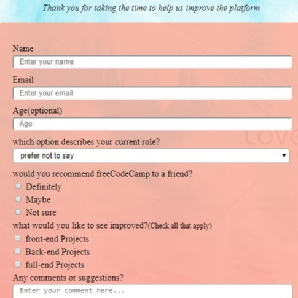
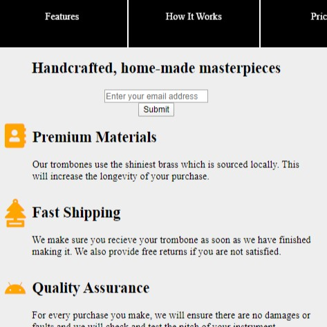

<!DOCTYPE html>
<html style="height:100%";>
<head style="height:100%";>
<meta name="viewport" content="width=device-width, initial-scale=1.0">

</head>
<body>
<nav id="navbar">
  <a href="#">About</a>
  <a href="#">Work</a>
  <a href="#">Contact</a>
</nav>
<section id="welcome-section">
  <h1 id="header">Hi I'm Su</h1>
  
a web designer

</section>
<section id="projects">
  
<b>These are some of my projects</b>

  

    

      <a href="" id="profile-link" target="_blank";>
        
        
survey

      </a>
    

    

      <a href="" id="profile-link" target="_blank";>
        
        
tribute

      </a>
    

    

       <a href="" id="profile-link" target="_blank";>
        
        
documentation

       </a>
    

    

       <a href="" id="profile-link" target="_blank";>
          
          
documentation

       </a>
    

    

    

  

</section>
<section id="footer">
</section>

</body>
</html>

